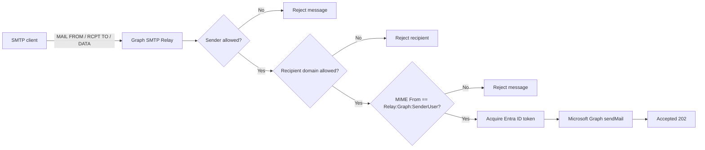

# Graph SMTP Relay

A lightweight SMTP relay that accepts SMTP messages and forwards them through Microsoft Graph `sendMail` using application credentials.

This project is useful when a system can only send via SMTP (for example monitoring or legacy software), but your organization requires Microsoft 365 / Exchange Online delivery through Graph.

## What It Does

- Listens for SMTP messages on a configurable port (default `2525`)
- Validates senders against an allow-list
- Optionally restricts recipient domains
- Ensures the MIME `From` address matches a configured Graph sender user
- Sends the original MIME message to Microsoft Graph `POST /users/{sender}/sendMail`
- Exposes a health endpoint: `GET /health`

## How It Works



## Prerequisites

- .NET SDK 10.0 (for local build/run)
- A Microsoft Entra ID app registration with:
  - Application permission: `Mail.Send`
  - Admin consent granted
- A mailbox/user in Microsoft 365 that Graph can send as (the value for `Relay:Graph:SenderUser`)

## Configuration

Configuration is loaded from `appsettings.json`, `appsettings.{Environment}.json`, and environment variables.

Start from `appsettings.template.json`:

```json
{
  "Relay": {
    "TenantId": "YOUR_TENANT_ID",
    "ClientId": "YOUR_APP_CLIENT_ID",
    "ClientSecret": "YOUR_APP_CLIENT_SECRET",
    "AllowedSenders": ["grafana@yourdomain.com"],
    "AllowedRecipientDomains": ["yourdomain.com"],
    "Graph": {
      "SenderUser": "grafana@yourdomain.com"
    },
    "Smtp": {
      "ServerName": "graph-smtp-relay",
      "Port": 2525
    }
  }
}
```

### Relay Settings Reference

- `Relay:TenantId`: Entra tenant ID used for token acquisition
- `Relay:ClientId`: application (client) ID
- `Relay:ClientSecret`: client secret for app-only auth
- `Relay:AllowedSenders`: list of exact sender addresses accepted at `MAIL FROM`
- `Relay:AllowedRecipientDomains`: optional list of recipient domains accepted at `RCPT TO`
  - If empty, all recipient domains are accepted
- `Relay:Graph:SenderUser`: mailbox UPN used in Graph path (`/users/{sender}/sendMail`)
  - Must match MIME `From` address exactly (case-insensitive)
- `Relay:Smtp:ServerName`: SMTP server identity string
- `Relay:Smtp:Port`: SMTP listening port

### Important Validation Behavior

1. Sender must be in `Relay:AllowedSenders`
2. If `Relay:AllowedRecipientDomains` has entries, each recipient domain must be in that list
3. MIME `From` must match `Relay:Graph:SenderUser`

If any check fails, the relay rejects the message during SMTP transaction.

## Quick Start (Local)

1. Copy template and set values:

```bash
cp appsettings.template.json appsettings.Development.json
```

2. Edit `appsettings.Development.json` with real tenant/app/mailbox values.

3. Build and run:

```bash
dotnet build
dotnet run
```

4. Verify health endpoint:

```bash
curl http://localhost:5074/health
```

Note: In development, launch settings expose HTTP on `http://localhost:5074`.

## Send a Test Message

Example using `swaks`:

```bash
swaks \
  --server 127.0.0.1:2525 \
  --from notification@yourdomain.com \
  --to user@yourdomain.com \
  --header "Subject: Graph SMTP Relay test" \
  --body "Hello from Graph SMTP Relay"
```

Make sure:

- `--from` is listed in `Relay:AllowedSenders`
- recipient domain is allowed by `Relay:AllowedRecipientDomains` (if configured)
- MIME `From` resolves to the same address as `Relay:Graph:SenderUser`

## Running With Environment Variables

Any setting can be overridden with environment variables using double underscores (`__`) for nesting.

Example:

```bash
export Relay__TenantId="<tenant-id>"
export Relay__ClientId="<client-id>"
export Relay__ClientSecret="<client-secret>"
export Relay__Graph__SenderUser="notification@yourdomain.com"
export Relay__Smtp__Port="2525"

dotnet run
```

For arrays, use indexed keys:

```bash
export Relay__AllowedSenders__0="notification@yourdomain.com"
export Relay__AllowedRecipientDomains__0="yourdomain.com"
```

## Docker

Build image:

```bash
docker build -t graph-smtp-relay:local .
```

Run container:

```bash
docker run --rm \
  -p 2525:2525 \
  -p 8080:8080 \
  -e Relay__TenantId="<tenant-id>" \
  -e Relay__ClientId="<client-id>" \
  -e Relay__ClientSecret="<client-secret>" \
  -e Relay__Graph__SenderUser="notification@yourdomain.com" \
  -e Relay__AllowedSenders__0="notification@yourdomain.com" \
  -e Relay__AllowedRecipientDomains__0="yourdomain.com" \
  graph-smtp-relay:local
```

Then verify:

```bash
curl http://localhost:8080/health
```

## Packaging Script

`package.sh` builds and exports an amd64 image tarball, then uploads it via `scp`.

Usage:

```bash
./package.sh <version-tag> <user@host>
```

Example:

```bash
./package.sh 1.0.0 deploy@example-host
```

This produces:

- `artifacts/graph-smtp-relay_<version-tag>_amd64.tar.gz`

## Logging and Diagnostics

The service logs:

- SMTP server startup/shutdown
- sender/recipient acceptance and rejection decisions
- Graph send failures with status codes
- successful relay summaries (subject, sender, recipients)

To increase log verbosity, adjust `Logging:LogLevel` in configuration.

## Troubleshooting

- `Relay:TenantId/ClientId/ClientSecret is missing`
  - Required values are not configured.
- SMTP sender rejected
  - Check `Relay:AllowedSenders` and exact sender address normalization.
- Recipient rejected
  - Check `Relay:AllowedRecipientDomains`.
- `Sender is not allowed`
  - MIME `From` does not match `Relay:Graph:SenderUser`.
- `Graph relay failed: HTTP <code>`
  - Check Graph app permissions (`Mail.Send`), admin consent, mailbox existence, and allowed send-as behavior.

## Security Notes

- Do not commit real secrets in `appsettings.json`.
- Prefer environment variables or a secrets manager in production.
- Rotate any client secret that was ever committed or shared.
- Restrict `AllowedSenders`/`AllowedRecipientDomains` to the minimal required set.

## Project Structure

- `Program.cs`: app startup, DI, Graph HTTP client, health endpoint
- `SmtpRelayHostedService.cs`: SMTP server lifecycle
- `RelayMailboxFilter.cs`: sender/recipient policy checks
- `RelayMessageStore.cs`: MIME load/validation and Graph relay execution
- `GraphMailSender.cs`: token acquisition and Graph `sendMail` API call
- `RelayOptions.cs`: configuration model (currently auth-related fields)

## License

See `LICENSE`.
